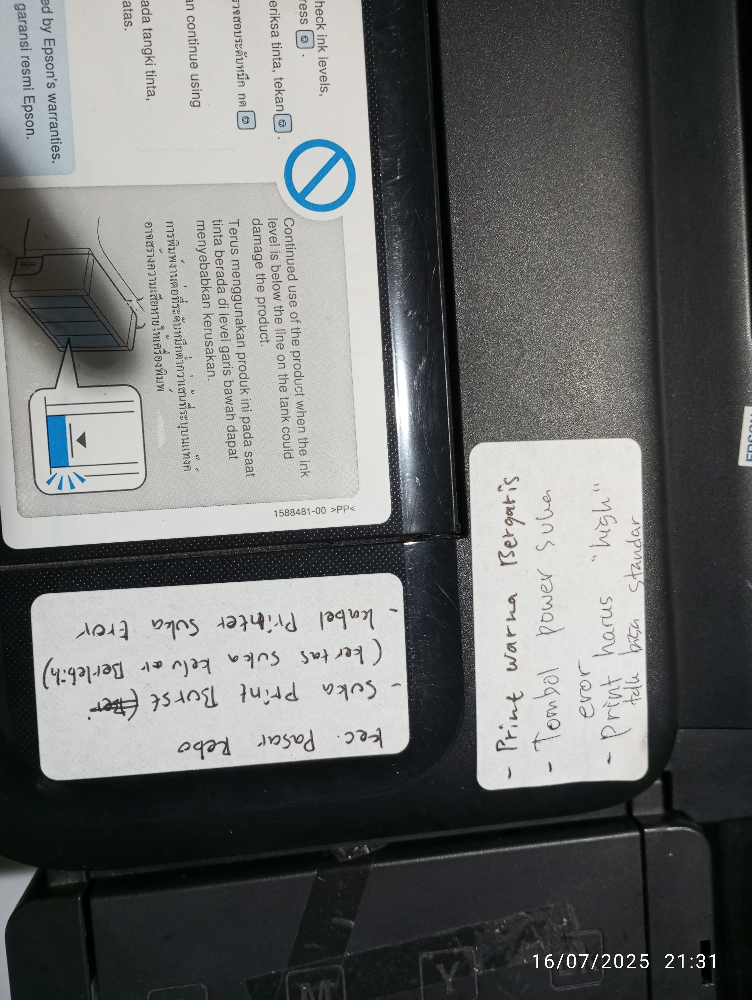
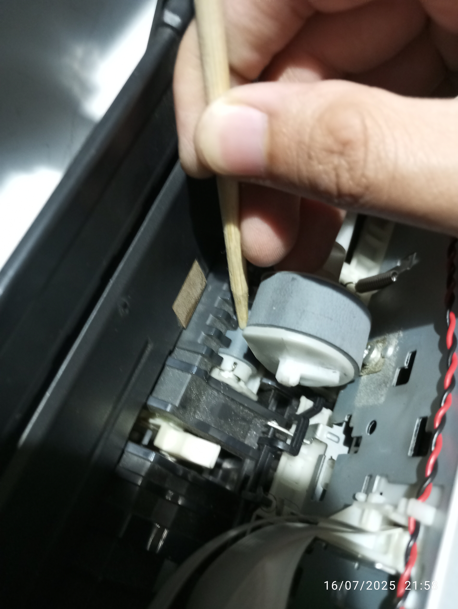
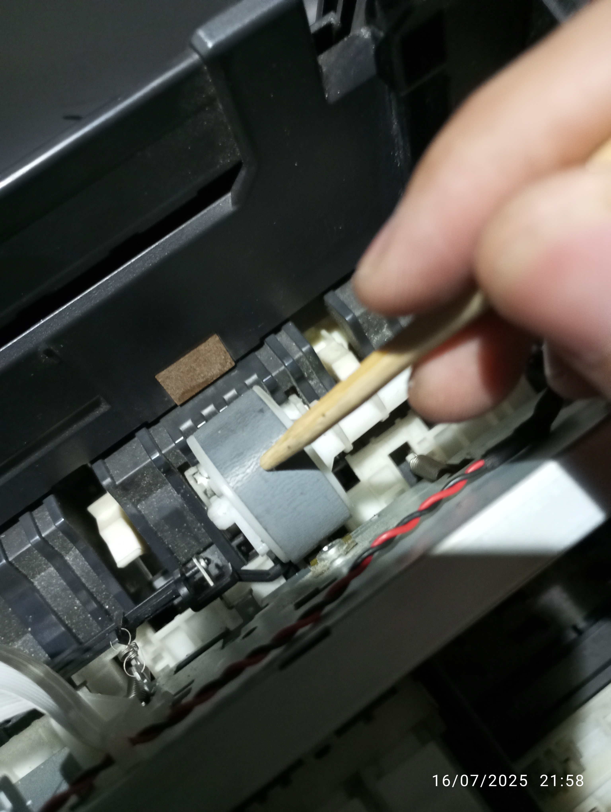

# L110 Pasar Rebo (PQ, PJ, GE)

<figure><figcaption></figcaption></figure>

## A. Indikasi

* Print quality:&#x20;
  * kerapatan semburan tinta yang keluar dari nozzle jelek (putus2 dan bending) saat di refurbish
  * hasil cetak blank (vonis sementara: fuse putus)
* Paper jam: kertas keluar banyak saat sekali print
* General Error: Kabel print head rusak menyebabkan printer susah nyala

## B. Action

### B1. Service adapter/CISS

<table data-view="cards"><thead><tr><th></th><th data-hidden data-card-cover data-type="files"></th></tr></thead><tbody><tr><td>black</td><td><a href=".gitbook/assets/IMG_20250716_220552.jpg">IMG_20250716_220552.jpg</a></td></tr><tr><td>yellow</td><td><a href=".gitbook/assets/IMG_20250716_220257.jpg">IMG_20250716_220257.jpg</a></td></tr></tbody></table>


Status part normal

Semua warna&#x20;


### B2. Refurbish print head


Dokumentasi proses refurbish ph&#x20;


Hasil refurbish ph kualitas nozzle masih jelek (_bending)_ pada cyan, magenta, yellow, dan black


Terindikasi print head **buntu**

Setelah di bersihkan (refurbish) hasil warna yang dikeluarkan masih jelek, perlu diganti baru


### B3. Check Shaft roller

<figure><figcaption></figcaption></figure>

Perputaran shaft roller sudah tidak normal, one-way gear yang mekanismenya yang menahan pergerakan balik roller. Namun, posisi part terindikasi rusak karena roller bebas bergerak dua arah


Status rusak

Harus diganti


### B4. Check pickup roller

<figure><figcaption></figcaption></figure>


Karet sudah tipis

Harus diganti


## C. Request Sparepart

* Print head L110
* ~~Shaft roller + Pickup roller L110~~
* ~~Kabel Print head~~

## D. Update

* [x] shaft roller: kawat mekanik penyangga patah
  * [x] repair (26 Juli 2025)
  * [ ] replace

<table data-view="cards"><thead><tr><th></th><th data-hidden data-card-cover data-type="files"></th></tr></thead><tbody><tr><td>repair shaft roller</td><td><a href=".gitbook/assets/WhatsApp Image 2025-07-26 at 19.23.45_18c64fa2.jpg">WhatsApp Image 2025-07-26 at 19.23.45_18c64fa2.jpg</a></td></tr><tr><td>pemasangan ke unit</td><td><a href=".gitbook/assets/IMG_20250726_192752.jpg">IMG_20250726_192752.jpg</a></td></tr></tbody></table>

* [x] kabel print head: jalur lepas, mika copot
  * [x] repair (26 Juli 2025)
  * [ ] replace

<table data-view="cards"><thead><tr><th></th><th data-hidden data-card-cover data-type="files"></th></tr></thead><tbody><tr><td>repair mika kabel head</td><td><a href=".gitbook/assets/IMG_20250721_084138.jpg">IMG_20250721_084138.jpg</a></td></tr></tbody></table>

* [ ] Print Head: tinta keluar, namun hasil ngeblank&#x20;
  * [ ] repair
  * [ ] replace (rekomendasi replace)
  * [ ] compare dengan print head L110 bagus
  * [ ] compare print head ini ke Printer L110 lain

## E. Request Part (Update 27 Juli 2025)

* Print Head L110
  * Rp997.500 (Fast Print Jakarta)

- [ ] fuse 2rb perak
- [x] mainboard bekas copotan L110
