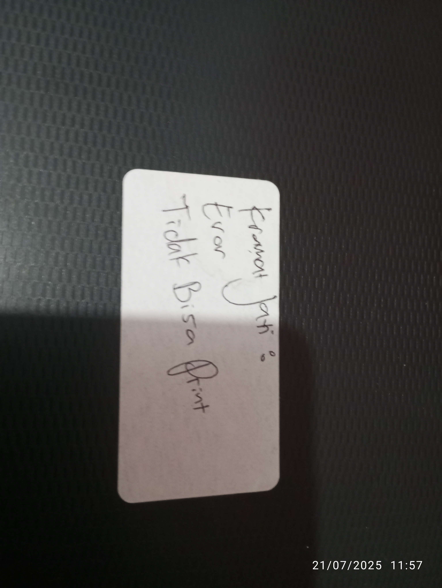
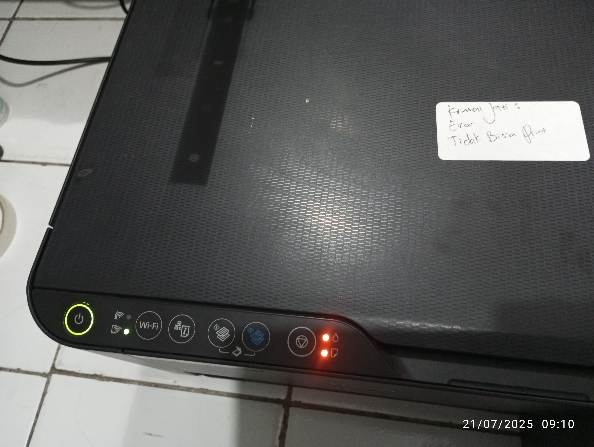
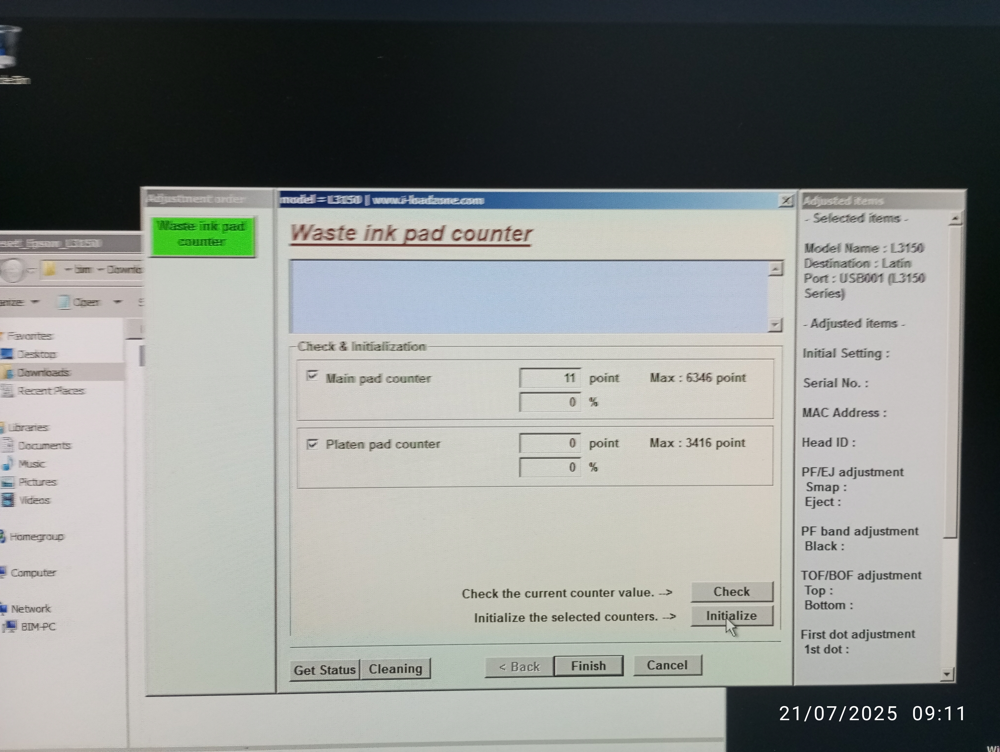
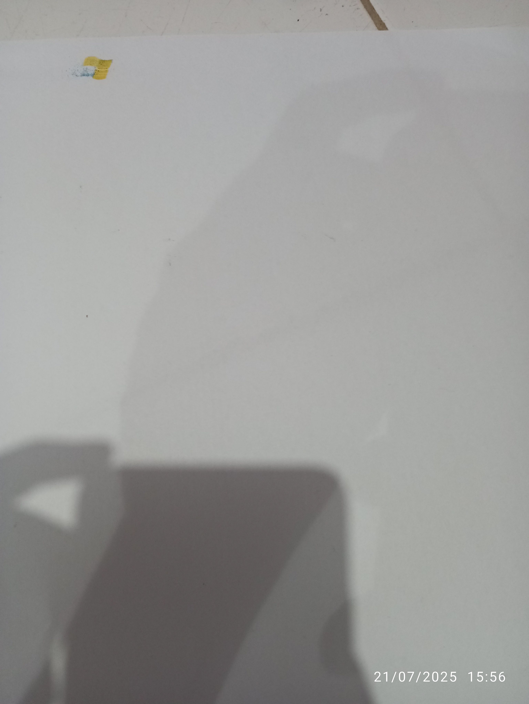
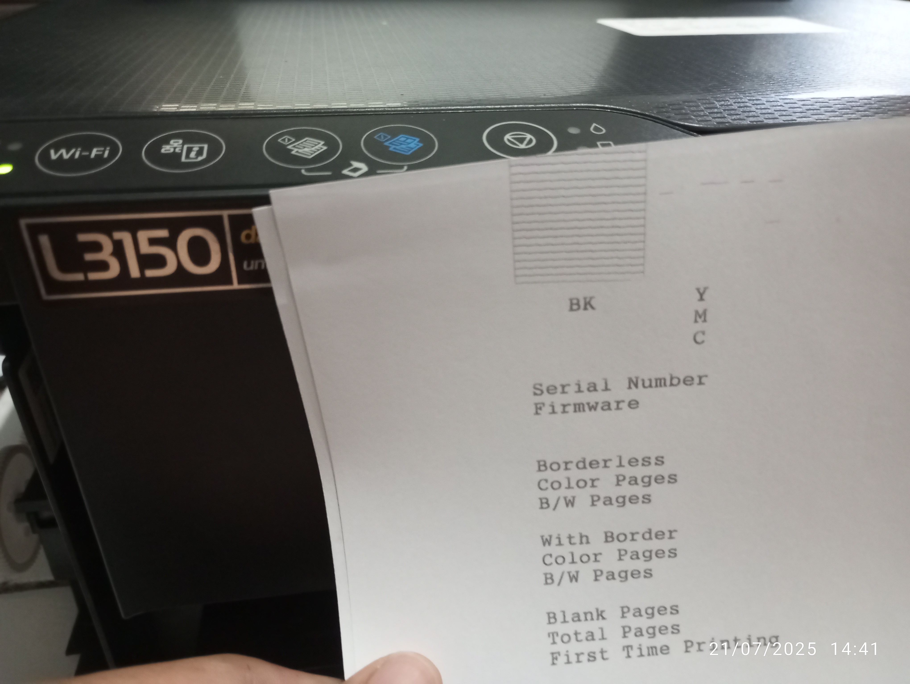
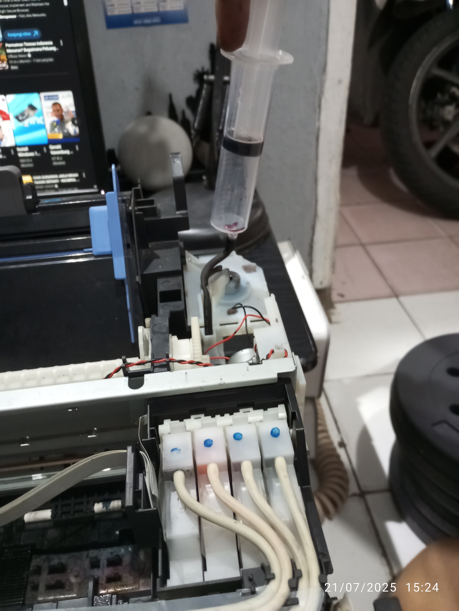
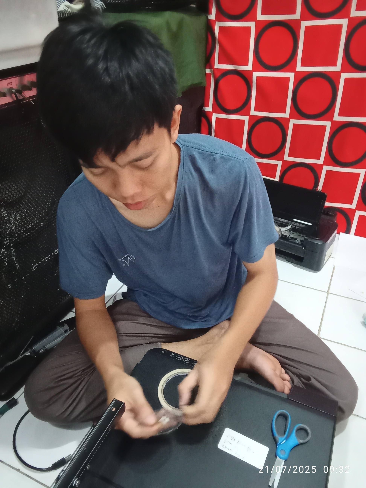

# L3150 Kramat Jati (FC, GE, PQ, PJ)

<figure><figcaption></figcaption></figure>

## A. Analisa dan indikasi

* Full counter: tidak bisa print karena cycle print sudah lewat batas, minta di reset via software
* General Error: disk encoder copot dari gear, harus di lem ulang
* Print quality: hasil print kacau, tidak ada warna hitam yang keluar, bahkan warna hanya sedikit bayangan saja
* Paper jam:&#x20;
  * saat print kertas berhenti ditengah-tengah
  * saat print kertas los, kemungkinan ada gear ompong

## B. Action

### B1. Waste Inkpad counter

<figure><figcaption></figcaption></figure>

Saat posisi lampu indikator seperti berikut menunjukkan printer dalam keadaan full counter. Maka printer tidak bisa dipakai.

<figure><figcaption></figcaption></figure>

Terlihat poin _pad counter_ dan setelah di _initialize_ untuk mereset poin ke angka 0 agar printer bisa kembali digunakan.


Ditahap ini printer sudah bisa printing untuk mengetes hasil cetakan nozzlenya


<figure><figcaption>
Hasil print test
</figcaption></figure>


Hasil print kacau

warna hitam sama sekali tidak keluar, warna cyan, magenta, yellow hanya sedikit


### B2. Service Adapter/CISS

<table data-view="cards"><thead><tr><th></th><th data-hidden data-card-cover data-type="files"></th></tr></thead><tbody><tr><td>sebelum</td><td><a href="../.gitbook/assets/IMG_20250721_141029.jpg">IMG_20250721_141029.jpg</a></td></tr><tr><td>sesudah</td><td><a href="../.gitbook/assets/IMG_20250721_141053.jpg">IMG_20250721_141053.jpg</a></td></tr><tr><td>refill</td><td><a href="../.gitbook/assets/IMG_20250721_141138.jpg">IMG_20250721_141138.jpg</a></td></tr></tbody></table>


part ini masih bagus, gelembung udara dan tidak mudah terbentuk didalam adapter sehingga tinta didalam adapter/CISS full


### B3. Service Print Head + Power ink flushing




Hasil refurbish

kuning dan biru belum sempurna, karena ada bending sedikit. Merah dan hitam hampir bagus (untuk print standard harusnya masih meninggalkan garis)


<figure><figcaption></figcaption></figure>


Hasil power ink flushing dan refurbish print head

tinta hitam keluar


<figure><figcaption>
Setelah action
</figcaption></figure>


Hasil akhir

kesimpulannya dengan hasil cetak yang tidak sesuai dengan hasil keluaran warna saat refurbish (disaat ciss adapter kondisinya bagus) maka dinyatakan problem bukan dari hanya dari print head.&#x20;


Maka, dilanjut cek ink system

### B4. Check Ink system

<figure><figcaption></figcaption></figure>

Setelah dilakukan pengetesan menarik tinta ink system dari selang pembuangan ternyata tidak ada tinta yang tertarik walaupun posisi print head sudah tepat diatas ink system


Kesimpulan

problem print quality ada 2 part yang menjadi perhatian yaitu print head dan ink system


### B5. Service Disk encoder + check gear dan karet shaft/pickup roller

<figure><figcaption></figcaption></figure>

disk encoder dan sensor dibersihkan, lalu dilem ulang agar pergerakan kertas keluar terbaca baik di sensor.


part masih bisa di service dan berfungsi normal


<table data-view="cards"><thead><tr><th></th><th data-hidden data-card-cover data-type="files"></th></tr></thead><tbody><tr><td>gear &#x26; clutch</td><td><a href="../.gitbook/assets/IMG_20250715_170022.jpg">IMG_20250715_170022.jpg</a></td></tr><tr><td>gear 2</td><td><a href="../.gitbook/assets/IMG_20250715_170037.jpg">IMG_20250715_170037.jpg</a></td></tr><tr><td>gear 3</td><td><a href="../.gitbook/assets/IMG_20250715_170029.jpg">IMG_20250715_170029.jpg</a></td></tr></tbody></table>


gerigi masih kokoh belum ada yang ompong

Kesimpulannya, problem paper jam dan _nge-lost_ disebabkan oler kotornya dan kurang menempelnya disk encoder pada gear sisi kiri. Namun, disarankan ganti baru karena yang lama sudah pengok


## C. Request Sparepart

* Print Head
* Ink system L3150
* Disk encoder
* Kabel Scanner

## D. Update

* [ ] Print Head (ID: 38E88 77POX)
  * [x] repair dengan cleaner 8 jam (27 Juli 2025)
  * [x] repair dengan spuit refurbish (27 Juli 2025)
  * [ ] replace
* [ ] Mainboard sort di mosfet setelah head cleaning

Hasil Print Head setelah di repair

* Hitam:  banyak bolong dan bending
* Kuning: bending dikit
* Merah: bolong dikit
* Biru: bolong dikit

- [ ] Ink

## E. Request Part (Update 27 Juli 2025)

* Print Head L3150&#x20;
  * Rp700.000 (kenalan pic: Mamat)&#x20;
    * Rp997.500 (FastPrint Jakarta)
* mosfet L3150 1 set&#x20;
  * Rp9.500 (FixPrint Jakarta)

